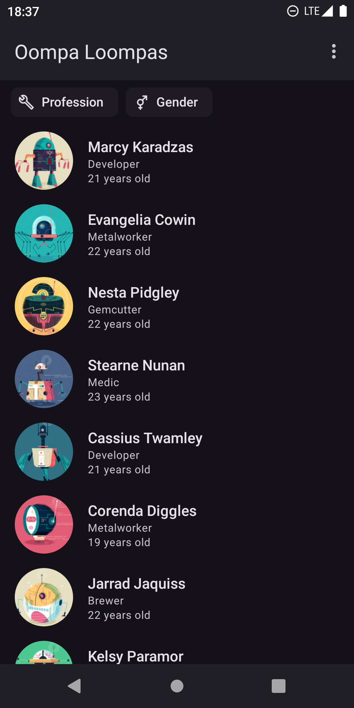
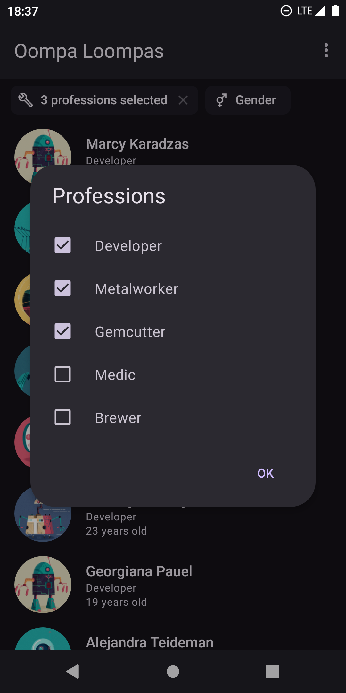
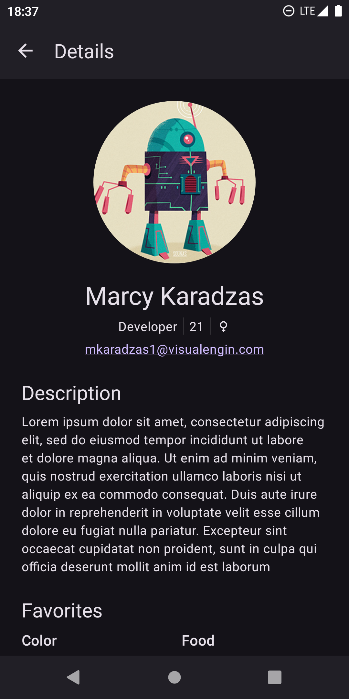
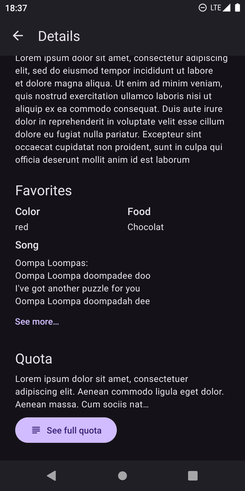
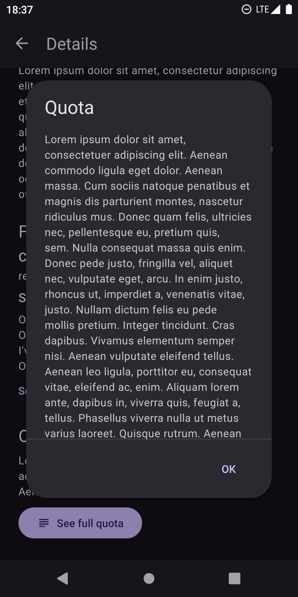
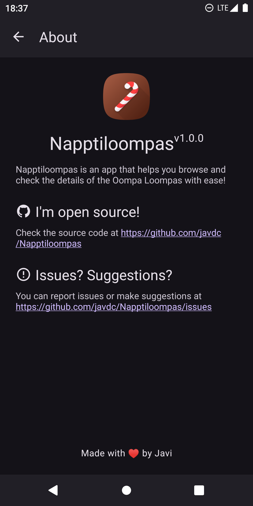

    
    <h1>Napptiloompas</h1>
    <h5>🍫 A sweet app to manage your Oompa Loompas 🍫</h5>
    
    

## Description
Napptiloompas is an Android app made for a code challenge from **Napptilus Tech Labs**. With Napptiloompas you can browse the list of Oompa Loompas from an API and check the details of them easily.

## Features
- Paginated list with infinite scroll
- Possibility to filter the list by profession, gender or both
- Beautiful Material transition animations between screens
- Full error control with descriptive error messages and retry buttons
- Material 3 & Material You dynamic theming
- Light/dark mode depending on your phone configuration
- ... and more!

## Screenshots

## Download

## Architecture overview
This project follows **Clean Architecture** and is separated into three main layers: presentation, domain and data. To truly achieve this separation, a multi-module approach was used. This way, the data layer and the presentation layer are not visible to each other, and each one only depends on the domain layer, like shown in this diagram:

*Source: Mario Sanoguera at Medium*

And, of course, this project also follows the **MVVM** architectural pattern and the **SOLID** principles when applicable.

## Dependencies
- **Kotlin**, a modern programming language interoperable with Java that provides a lot of useful advantages like null safety and more syntactic sugar (yum)
- **Kotlin Coroutines & Flow** for easier asynchronous code execution
- **OkHttp3 & Retrofit**, well known and robust libraries for network requests
- **OkHttp logging interceptor**, which prints call and response information in console, useful for debugging purposes
- **GSON** for response serialization
- **Kermit** for easy logging without depending on the Android SDK (some modules here are not defined as Android modules)
- **Hilt**, a library that simplifies the implementation of **Dagger**, a very popular compile-time dependency injection library
- **Material Components**, a library that provides a set of useful view components and other tools that follows the Material Design principles
- **View Binding**, a must to interact with views in your code safely
- **AndroidX Lifecycle** libraries, including **LiveData** and **ViewModel**, useful tools to implement MVVM architecture and help you manage the lifecycle of the screens
- **Glide**, a lightweight and easy to use library to load and cache remote images.
- **Navigation Component**, a set of libraries and tools for advanced navigation across screens
- Other well-known libraries like **Android Core KTX** for useful Kotlin extensions or **AppCompat** for better compatibility in older Android versions.

## Credits
- Candy cane icon created by Freepik